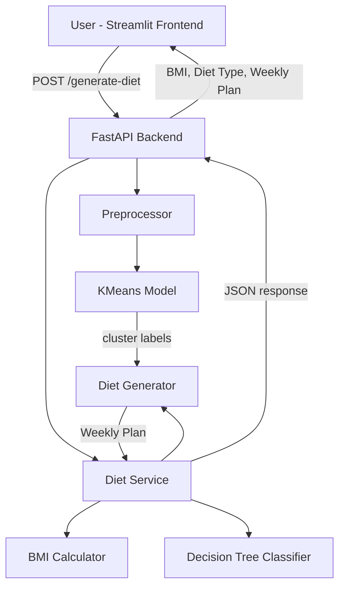

# Design Document: Smart Weekly Diet Planner

## Overview

The Smart Weekly Diet Planner is a Python-based full-stack application. A Streamlit frontend collects user health data and renders results. A FastAPI backend orchestrates BMI calculation, food clustering via K-Means, diet-type classification via an ID3 Decision Tree, and weekly meal plan generation. All ML models are trained once at startup from a CSV food dataset and reused across requests.

---

## Architecture



The application starts up by loading and preprocessing the food dataset, training the KMeans model, and then serving requests through the FastAPI endpoint. The Streamlit frontend is a separate process that calls the backend over HTTP.

---

## Components and Interfaces

### 1. Preprocessor (`backend/utils/preprocessing.py`)

Responsible for loading the CSV and preparing features for clustering.

```python
def load_and_preprocess(csv_path: str) -> pd.DataFrame:
    """
    Load food dataset, drop rows with negative/null nutritional values,
    and normalize calories, protein, carbohydrates, fat columns using MinMaxScaler.
    Returns the cleaned DataFrame with an added 'normalized_features' column set.
    Raises FileNotFoundError if csv_path does not exist.
    Raises ValueError if required columns are missing.
    """
```

Required CSV columns: `food_name`, `calories`, `protein`, `carbohydrates`, `fat`

### 2. KMeans Model (`backend/models/kmeans_model.py`)

Clusters food items into nutritional groups.

```python
def train_kmeans(data: pd.DataFrame, n_clusters: int = 3) -> tuple[KMeans, pd.DataFrame]:
    """
    Fit KMeans on normalized nutritional features.
    Assigns cluster labels back to the DataFrame as column 'cluster'.
    Returns (fitted_model, labeled_dataframe).
    Raises ValueError if len(data) < n_clusters.
    """

def get_cluster_for_diet_type(diet_type: str) -> int:
    """
    Returns the cluster index that maps to the given diet_type.
    Mapping: 'weight_loss' -> lowest-calorie cluster,
             'weight_gain' -> highest-protein cluster,
             'maintenance' -> balanced cluster.
    """
```

Cluster-to-diet mapping is determined post-training by inspecting cluster centroids.

### 3. BMI Calculator (`backend/utils/bmi.py`)

```python
def calculate_bmi(weight_kg: float, height_cm: float) -> tuple[float, str]:
    """
    Returns (bmi_value rounded to 2dp, bmi_category).
    Categories: 'Underweight' < 18.5, 'Normal' 18.5-24.9,
                'Overweight' 25-29.9, 'Obese' >= 30.
    Raises ValueError if height_cm <= 0 or weight_kg <= 0.
    """
```

### 4. Decision Tree Classifier (`backend/models/decision_tree.py`)

ID3-style rule-based classifier mapping user attributes to a diet type. Given the small, well-defined input space (BMI category × activity level × goal), this is implemented as an explicit rule tree rather than a trained sklearn model, ensuring full interpretability and no training data dependency.

```python
DIET_RULES: dict  # nested dict: bmi_category -> activity_level -> goal -> diet_type

def classify_diet_type(bmi_category: str, activity_level: str, goal: str) -> str:
    """
    Returns one of: 'weight_loss', 'weight_gain', 'maintenance'.
    Raises ValueError if any input is not in the allowed set.
    """
```

Allowed values:
- `bmi_category`: Underweight, Normal, Overweight, Obese
- `activity_level`: sedentary, lightly_active, moderately_active, very_active
- `goal`: weight_loss, weight_gain, maintenance

### 5. Diet Generator (`backend/utils/diet_generator.py`)

```python
def generate_weekly_plan(
    cluster_data: pd.DataFrame,
    seed: int | None = None
) -> dict[str, dict[str, str]]:
    """
    Selects food items from cluster_data to fill a 7-day plan.
    Structure: { 'Monday': {'breakfast': '...', 'lunch': '...', 'dinner': '...'}, ... }
    No food item repeats within the same day.
    Uses seed for reproducibility in tests.
    Raises ValueError if cluster_data has fewer than 3 unique food items.
    """
```

### 6. Diet Service (`backend/services/diet_services.py`)

Orchestration layer called by the API endpoint.

```python
def generate_plan(
    age: int,
    weight_kg: float,
    height_cm: float,
    activity_level: str,
    goal: str,
    data: pd.DataFrame
) -> dict:
    """
    Coordinates BMI calculation, diet type classification, cluster selection,
    and weekly plan generation.
    Returns: {
        'bmi': float,
        'bmi_category': str,
        'diet_type': str,
        'weekly_plan': dict
    }
    """
```

### 7. FastAPI Backend (`backend/main.py`)

```python
@app.post("/generate-diet")
def generate_diet(
    age: int,
    height: float,   # cm
    weight: float,   # kg
    activity_level: str,
    goal: str
) -> JSONResponse:
    """
    Validates inputs, calls Diet_Service, returns JSON.
    Returns HTTP 422 on validation failure.
    """
```

### 8. Streamlit Frontend (`frontend/app.py`)

- Input form: age (number_input), height (number_input), weight (number_input), activity_level (selectbox), goal (selectbox)
- On submit: POST to backend `/generate-diet`
- Display: BMI metric, diet type label, weekly plan as `st.dataframe`
- On error: `st.error()` with user-friendly message

---

## Data Models

### Food Item (row in DataFrame)

| Field | Type | Description |
|---|---|---|
| food_name | str | Display name of the food |
| calories | float | kcal per serving |
| protein | float | grams per serving |
| carbohydrates | float | grams per serving |
| fat | float | grams per serving |
| cluster | int | Assigned by KMeans (added at runtime) |

### Weekly Plan (Python dict / JSON)

```json
{
  "Monday":    { "breakfast": "Oatmeal",      "lunch": "Grilled Chicken", "dinner": "Salad" },
  "Tuesday":   { "breakfast": "Eggs",         "lunch": "Brown Rice",      "dinner": "Soup"  },
  "Wednesday": { "breakfast": "Yogurt",       "lunch": "Tuna Wrap",       "dinner": "Stir Fry" },
  "Thursday":  { "breakfast": "Banana",       "lunch": "Lentil Soup",     "dinner": "Grilled Fish" },
  "Friday":    { "breakfast": "Whole Wheat Toast", "lunch": "Quinoa Bowl","dinner": "Vegetable Curry" },
  "Saturday":  { "breakfast": "Smoothie",     "lunch": "Chicken Salad",   "dinner": "Pasta" },
  "Sunday":    { "breakfast": "Pancakes",     "lunch": "Veggie Burger",   "dinner": "Roast Chicken" }
}
```

### API Request Parameters

| Parameter | Type | Constraints |
|---|---|---|
| age | int | 1–120 |
| height | float | > 0 (cm) |
| weight | float | > 0 (kg) |
| activity_level | str | sedentary, lightly_active, moderately_active, very_active |
| goal | str | weight_loss, weight_gain, maintenance |

### API Response

```json
{
  "bmi": 22.5,
  "bmi_category": "Normal",
  "diet_type": "maintenance",
  "weekly_plan": { ... }
}
```

---

## Correctness Properties

*A property is a characteristic or behavior that should hold true across all valid executions of a system — essentially, a formal statement about what the system should do. Properties serve as the bridge between human-readable specifications and machine-verifiable correctness guarantees.*

### Property-Based Testing Overview

Property-based testing (PBT) validates software correctness by testing universal properties across many generated inputs. The library used is **Hypothesis** (Python), configured with a minimum of 100 examples per property test.

Each test is annotated with:
`# Feature: smart-diet-planner, Property N: <property_text>`

---

Property 1: BMI calculation is mathematically correct

*For any* valid weight (kg) and height (cm), the computed BMI should equal `weight / (height / 100) ** 2` rounded to two decimal places.
**Validates: Requirements 2.1**

---

Property 2: BMI category boundaries are correct

*For any* valid weight and height, the returned BMI category should be exactly the category whose boundary the computed BMI value falls within (Underweight < 18.5, Normal 18.5–24.9, Overweight 25–29.9, Obese ≥ 30).
**Validates: Requirements 2.2**

---

Property 3: Every food item receives a cluster label

*For any* preprocessed dataset with at least 3 rows, after training KMeans every row in the returned DataFrame should have a non-null integer `cluster` value in the range [0, n_clusters).
**Validates: Requirements 4.2**

---

Property 4: Weekly plan structure invariant

*For any* cluster dataset with sufficient food items, the generated Weekly_Plan should contain exactly 7 day keys, each with exactly 3 meal-slot keys (breakfast, lunch, dinner), and no meal slot value should be empty.
**Validates: Requirements 6.2**

---

Property 5: No same-day food repetition

*For any* generated Weekly_Plan, within each day the three meal values (breakfast, lunch, dinner) should all be distinct food items.
**Validates: Requirements 6.3, 6.4**

---

Property 6: Diet Generator only uses foods from the correct cluster

*For any* diet type and its corresponding cluster, every food item appearing in the generated Weekly_Plan should be present in the cluster's food list.
**Validates: Requirements 6.1**

---

Property 7: Weekly plan serialization round-trip

*For any* valid Weekly_Plan dictionary, serializing it to JSON and deserializing it back should produce an equal dictionary.
**Validates: Requirements 9.2**

---

Property 8: Decision Tree covers all valid input combinations

*For any* combination of valid BMI category, activity level, and goal, the Decision Tree should return one of the three valid diet types without raising an error.
**Validates: Requirements 5.1**

---

Property 9: Preprocessing removes invalid rows

*For any* dataset containing rows with negative or null nutritional values, after preprocessing none of the remaining rows should have negative or null values in calories, protein, carbohydrates, or fat.
**Validates: Requirements 3.2**

---

## Error Handling

| Scenario | Component | Behavior |
|---|---|---|
| CSV file missing | Preprocessor | Raise `FileNotFoundError` with path; halt startup |
| Required CSV columns missing | Preprocessor | Raise `ValueError` listing missing columns |
| height ≤ 0 or weight ≤ 0 | BMI_Calculator | Raise `ValueError("Invalid height/weight")` |
| Invalid activity_level or goal | Decision_Tree | Raise `ValueError` listing allowed values |
| Cluster data < 3 unique foods | Diet_Generator | Raise `ValueError("Insufficient food items in cluster")` |
| Dataset rows < n_clusters | KMeans_Model | Raise `ValueError("Not enough data for clustering")` |
| Backend validation failure | FastAPI | Return HTTP 422 with detail message |
| Backend runtime error | FastAPI | Return HTTP 500 with generic message; log full traceback |
| Backend unreachable | Frontend | Display `st.error("Could not connect to the diet planner service.")` |

---

## Testing Strategy

### Dual Testing Approach

Both unit tests and property-based tests are required and complementary.

- Unit tests verify specific examples, edge cases, and error conditions
- Property tests verify universal properties across all inputs using **Hypothesis**

### Unit Tests

Located in `backend/tests/`. Cover:
- BMI edge cases: height = 0, weight = 0, boundary values (18.5, 25.0, 30.0)
- Preprocessor: missing file, missing columns, rows with nulls/negatives
- Decision Tree: all valid combinations, invalid inputs
- Diet Generator: minimum food items, 7-day structure, no same-day repeats
- API endpoint: valid request returns 200, missing fields return 422

### Property-Based Tests

Located in `backend/tests/test_properties.py`. Each test uses `@given` from Hypothesis with `settings(max_examples=100)`.

| Test | Property | Requirements |
|---|---|---|
| `test_bmi_calculation` | Property 1 | 2.1 |
| `test_bmi_category_boundaries` | Property 2 | 2.2 |
| `test_kmeans_all_labeled` | Property 3 | 4.2 |
| `test_weekly_plan_structure` | Property 4 | 6.2 |
| `test_no_same_day_repetition` | Property 5 | 6.3, 6.4 |
| `test_plan_uses_correct_cluster` | Property 6 | 6.1 |
| `test_weekly_plan_round_trip` | Property 7 | 9.2 |
| `test_decision_tree_coverage` | Property 8 | 5.1 |
| `test_preprocessing_removes_invalid` | Property 9 | 3.2 |

Tag format used in each test file:
```python
# Feature: smart-diet-planner, Property N: <property_text>
```
